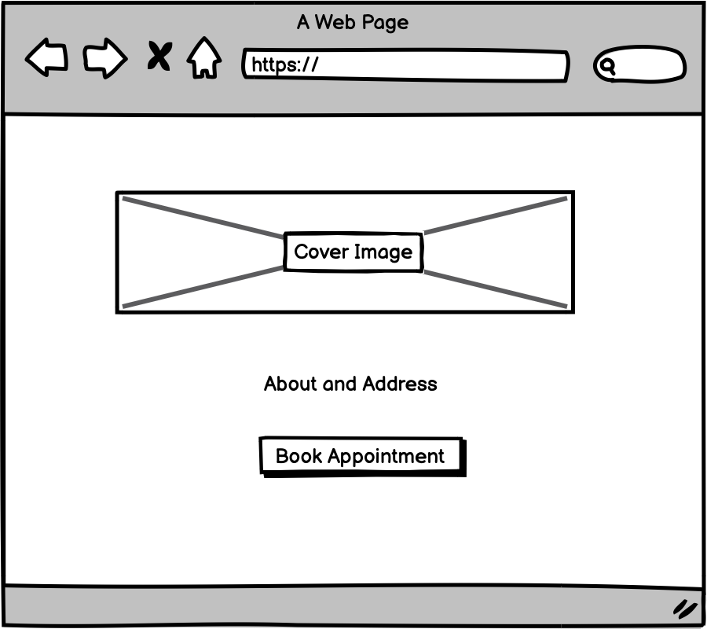
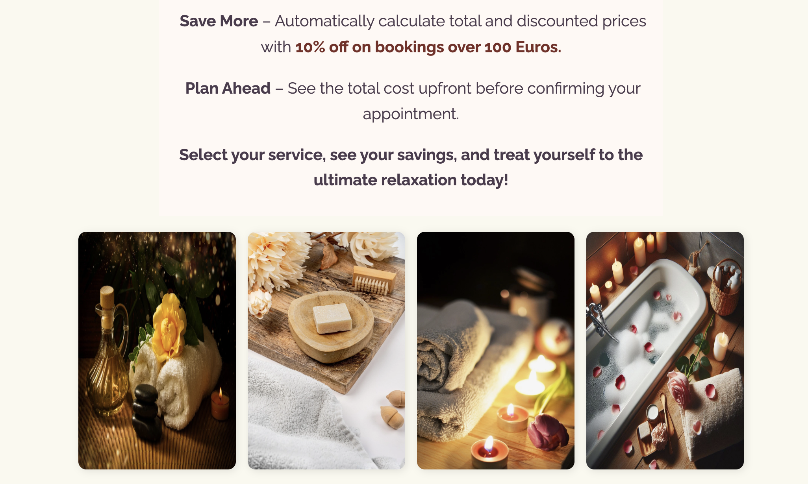
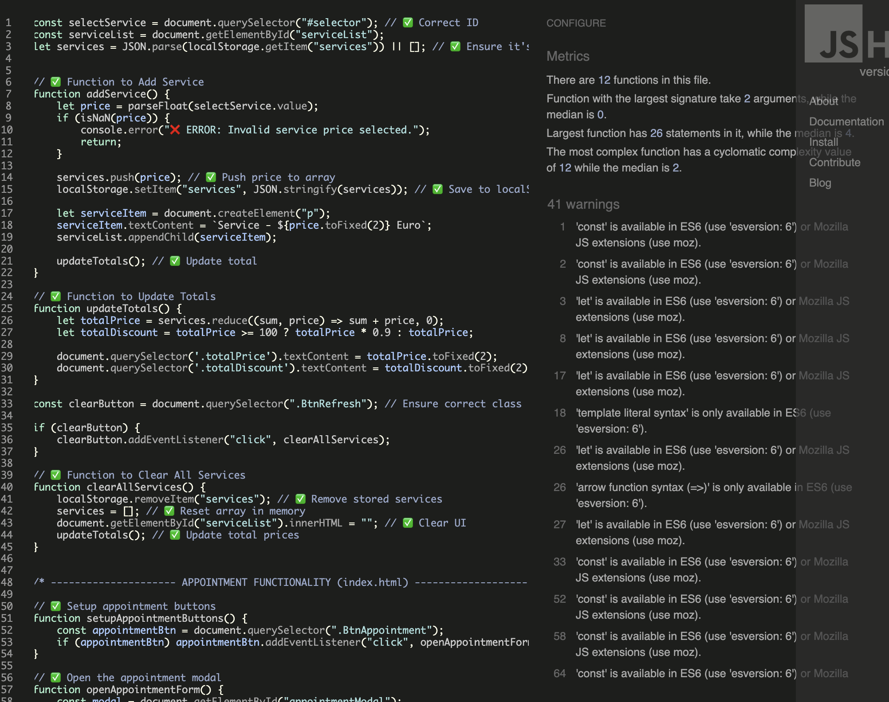
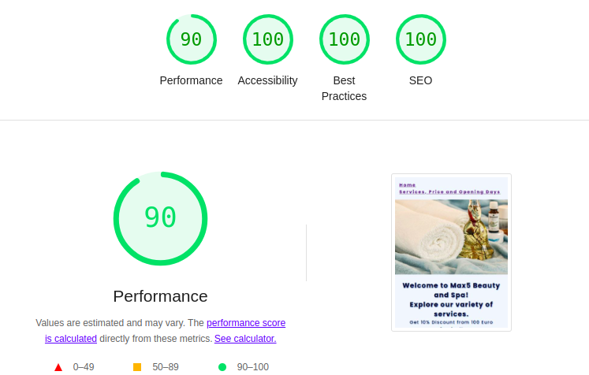
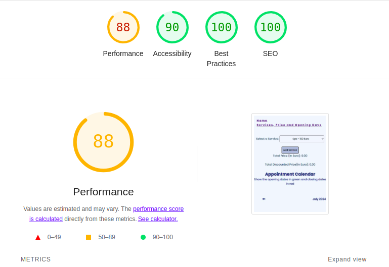

# Max5 Beauty and Spa

Max5 Beauty and Spa is a modern and user-friendly website designed for a luxurious spa experience. It provides visitors with a comprehensive overview of available services, pricing, discounts, and contact information, allowing users to plan their visit effortlessly.

The website includes:

* A detailed service selection with real-time pricing updates and discounts.

* A seamless booking system for scheduling appointments.

* Contact information and social media links for easy communication.

The live link is [here](https://farhatamannaislam.github.io/Portfolio2/)

# Overview

* The website is a two-page design (Home & Services) that ensures a smooth user experience.
* **Home Page:** Displays spa details, an elegant hero image, apoointment booking system, contact information, and exclusive discount offers.
* **Services Page:** Allows users to explore services, select treatments, view total pricing, and receive discounts when applicable.
* **Social Media Links:** Available on every page for easy access.

# Design

## Imagery

The website features carefully chosen images and icons to create a visually appealing and relaxing user experience.

## Fonts

The Raleway and Great Vibes font is the main font of this website ensuring a clean and modern look. The font was importetd via [Google Fonts](https://fonts.google.com/). Sans Serif is kept as a backup font.

# Wireframes

Wireframes are produced via Balsamiq.

  
Home Wireframe

  

  
Service Wireframe

  

# Menu Navigation

* The navigation menu is fixed at the top for easy access.

# Home Section

* **Hero Section:** Features a stunning spa image to create a welcoming ambiance.
* **Exclusive Discount Offer:** Encourages users to book services above 100 Euros to avail 10% discount.
* **Contact Information:** Provides email, phone number, and address for easy communication.

# Service Page

* Users can select and add multiple services. Encourages the user about discount.
* Real-time price calculation shows total and discounted prices instantly.
* Contains pleasant images from spa to captivate users.

# Website Footer

It contains social media platform with their respective links.

# Testing 

## Validator Testing

* No errors were returned when passing through the official W3C Markup Validator
[W3C Validator Home](https://validator.w3.org/nu/?doc=https%3A%2F%2Ffarhatamannaislam.github.io%2FPortfolio2%2Findex.html)
[W3C validator Services](https://validator.w3.org/nu/?doc=https%3A%2F%2Ffarhatamannaislam.github.io%2FPortfolio2%2Fservices.html)

* No errors were found when passing through the official W3C CSS Validator
[W3C Validator CSS](https://jigsaw.w3.org/css-validator/validator?uri=https%3A%2F%2Ffarhatamannaislam.github.io%2FPortfolio2%2Fassets%2Fcss%2Fstyle.css&profile=css3svg&usermedium=all&warning=1&vextwarning=&lang=en)

* No errors were found via JSHint

* The site achieved a Lighthouse accessibility score of 77% to 99% which confirms that the colours and fonts chosen are easy to read and accessible.

# Links Testing

* All navigation links were tested manually to ensure the user is directed to the correct section of the website.
* Social Media links in the footer of each page were tested manually to ensure they direct the user to the correct page and open in a new tab.

# Browser Testing

The Website was tested on Google Chrome, Firefox, Microsoft Edge, Safari browsers with no issues noted.

# Device Testing

* The website was viewed on a variety of devices such as Desktop, Laptop, Tablets and Mobiles to ensure responsiveness on various screen sizes. The website performed as intended. The responsive design was also checked using Chrome developer tools across multiple devices with structural integrity holding for the various sizes.
* The website is fully responsive. Responsiveness was checked via
[Responsitor](http://www.responsinator.com/?url=https%3A%2F%2Ffarhatamannaislam.github.io%2FPortfolio2%2Findex.html)
[Am I Responsive](https://ui.dev/amiresponsive?url=https://farhatamannaislam.github.io/Portfolio2/index.html)

# Bugs

There are no known bugs in the website.

# Future Improvements

Some commit messages have slight spelling mistakes. Readme was included in 06179ed5774c6a166b4003b9a60c3e79f3a4670e. But unfortunately the commit message doesn't
include this information. So there is a scope of improvement in commit messages.

# Technologies Used

## Languages
* HTML
* CSS
* JavaScript

## Frameworks - Libraries - Programs Used

* [Am I Responsive](https://ui.dev/amiresponsive?url=https://farhatamannaislam.github.io/Portfolio2/index.html) used to verify responsiveness.
* [Responsitor](http://www.responsinator.com/?url=https%3A%2F%2Ffarhatamannaislam.github.io%2FPortfolio2%2Findex.html) used to verify responsiveness.
* [W3C HTML Validator](https://validator.w3.org/) used to verify HTML.
* [W3C CSS Validator](https://jigsaw.w3.org/css-validator/) used to verify CSS.
* [JSHint](https://jshint.com/) used to verify JavaScript.
* [Balsamiq](https://balsamiq.com/) used to create Wireframes.
* [GitHub](https://github.com/) Used for version control and hosting.
* [Google Fonts](https://fonts.google.com/) Used to import and alter fonts on the page.
* [Imagesmaller](https://www.imagesmaller.com/) Used to optimize the images for web.
* [Convertio](https://convertio.co/) Used to optimize the images for web.
* [Flaticon](https://www.flaticon.com/) Used to get the icon for the website.

# Deployment
* In the Github repository, I navigated to Settings tab.
* From the source section drop-down menu, I selected the main branch and Save.
* A few moments later, the page was automatically refreshed and the link to the website was displayed on the right side of the page. 

The live link can be found here - [Max5 Beauty and Spa](https://farhatamannaislam.github.io/Portfolio2/)

# Credits
The image of the website is taken from [Pixabay](https://pixabay.com/).
Thanks to the amazing Photographer.

# Resources
* [StackOverflow](https://stackoverflow.com/)
* [W3C School](https://www.w3schools.com/)
* Code Institute [Love Math](https://github.com/farhatamannaislam/lovae-maths) Project

# Acknowledgments
* My mentor Antonio Rodriguez for his valueable support and advice.
* Code Institute Slack community and tutors for their helpful responses and feedback.