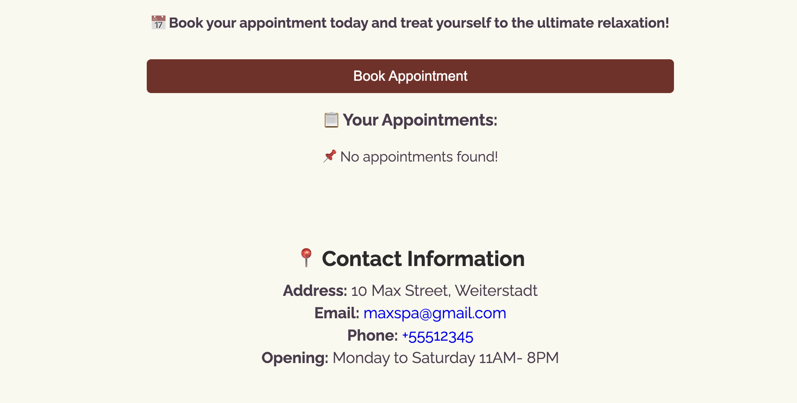
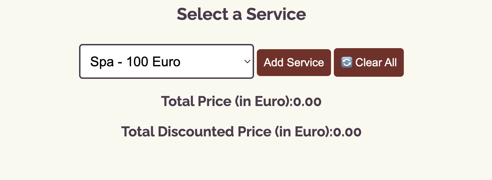

# Max5 Beauty and Spa

Max5 Beauty and Spa is a Website for a spa that gives brief overview of its content.

Users of this website can find about the services they offer, related price and discount if they have a service of certain amount. They can also find out information about the opening and closing days of the SPA via a calendar. The adress and contact information with social media links can be found via the website.

The live link is [here]()

# Overview

* The website is designed as two page website with home and service.
* In the webpage the user gets a beautiful spa image with Address, contact information and discount information.
* In the service page the user gets service name, related price and discount price information. They can also see a calendar with opening dates and closing dates.
* Social media links are available in both pages.

# Design

## Imagery

The image and icon used in this website are very important. They offer a visually appealing scenario to the user. The website color is very soothing.

## Fonts

The Poppins font is the main font of this website. The font was importetd via [Google Fonts](https://fonts.google.com/). Sans Serif is kept as a backup font.

# Wireframes

Wireframes are produced via Balsamiq.

  
Desktop Wireframe

  

  
Desktop Wireframe

  

  
Mobile Wireframe

  

  
Mobile Wireframe

  

# Menu Navigation

* It is locaed on the top left of the website.
* It has a fixed position at the top so that users have access to the menu at all times when scrolling through the content.

# Home Section

* It has a hero image showing a beautiful and soothing spa picture.
* It contains discount information.
* It contains Spa address and contact information.

# Service Page

* In this page user finds information about service and related price. Users can choose and add services as they like. If the price reaches a certain value user will get a discount. Discount price is shown in the page too.

* There is a nice calendar showing the opening and closing dates of the spa. The spa is closed on sundays. Sundays are shown in red and all other days are shown in gree.

# Website Footer

It contains social media platform with their respective links.

# Testing 

## Validator Testing