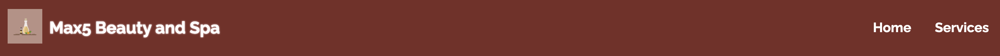
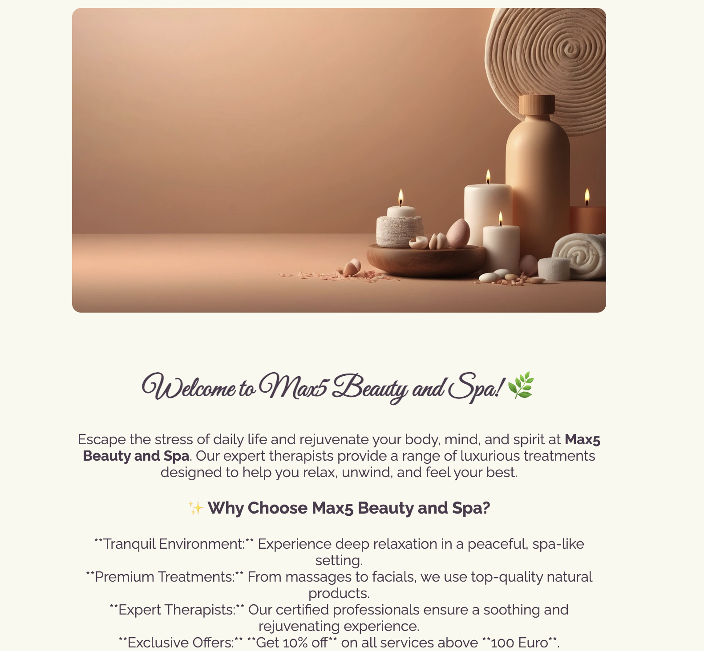
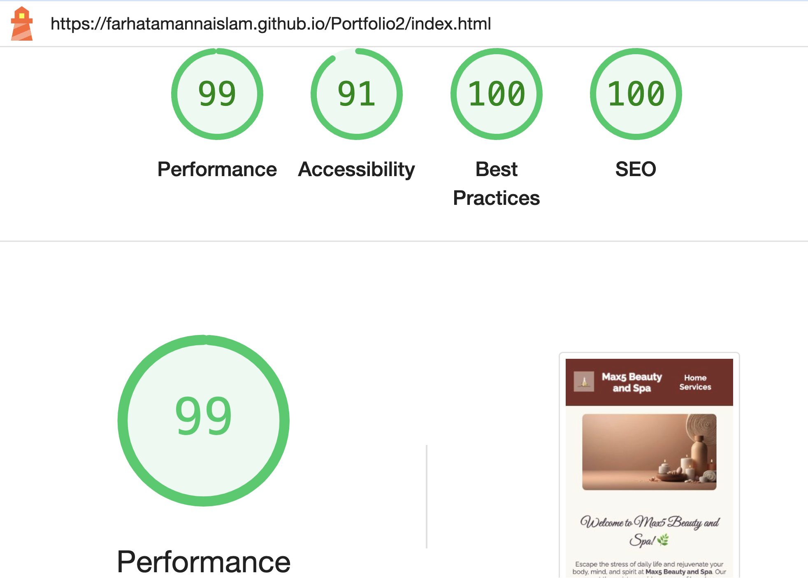
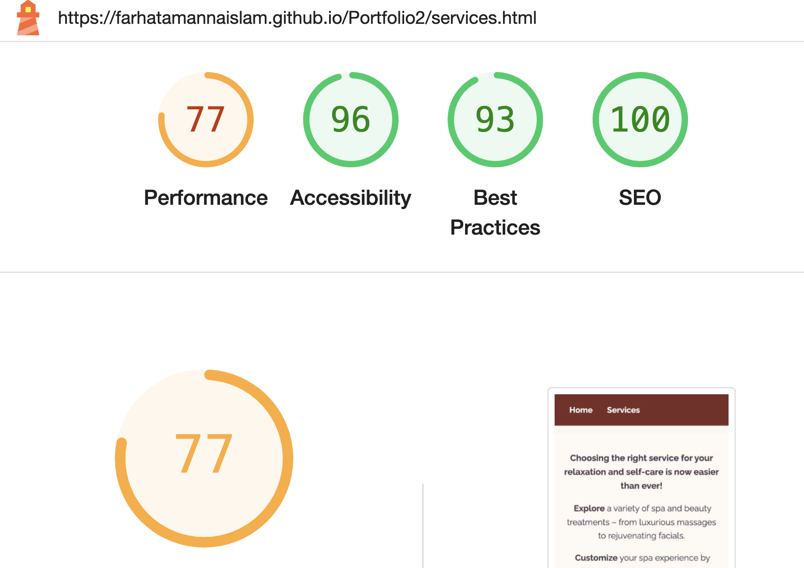

# Max5 Beauty and Spa

Max5 Beauty and Spa is a Website for a spa that gives brief overview of its content.

Users of this website can find about the services they offer, related price and discount if they have a service of certain amount. They can also find out information about the opening and closing days of the SPA via a calendar. The adress and contact information with social media links can be found via the website.

The live link is [here](https://farhatamannaislam.github.io/Portfolio2/)

# Overview

* The website is designed as two page website with home and service.
* In the webpage the user gets a beautiful spa image with Address, contact information and discount information.
* In the service page the user gets service name, related price and discount price information. They can also see a calendar with opening dates and closing dates.
* Social media links are available in both pages.

# Design

## Imagery

The image and icon used in this website are very important. They offer a visually appealing scenario to the user. The website color is very soothing.

## Fonts

The Poppins font is the main font of this website. The font was importetd via [Google Fonts](https://fonts.google.com/). Sans Serif is kept as a backup font.

# Wireframes

Wireframes are produced via Balsamiq.

  
Desktop Wireframe

  

  
Desktop Wireframe

  

  
Mobile Wireframe

  

  
Mobile Wireframe

  

# Menu Navigation

* It is locaed on the top left of the website.
* It has a fixed position at the top so that users have access to the menu at all times when scrolling through the content.

# Home Section

* It has a hero image showing a beautiful and soothing spa picture.
* It contains discount information.
* It contains Spa address and contact information.

# Service Page

* In this page user finds information about service and related price. Users can choose and add services as they like. If the price reaches a certain value user will get a discount. Discount price is shown in the page too.

* There is a nice calendar showing the opening and closing dates of the spa. The spa is closed on sundays. Sundays are shown in red and all other days are shown in gree.

# Website Footer

It contains social media platform with their respective links.

# Testing 

## Validator Testing

* No errors were returned when passing through the official W3C Markup Validator
[W3C Validator Home](https://validator.w3.org/nu/?doc=https%3A%2F%2Ffarhatamannaislam.github.io%2FPortfolio2%2Findex.html)
[W3C validator Services](https://validator.w3.org/nu/?doc=https%3A%2F%2Ffarhatamannaislam.github.io%2FPortfolio2%2Fservices.html)

* No errors were found when passing through the official W3C CSS Validator
[W3C Validator CSS](https://jigsaw.w3.org/css-validator/validator?uri=https%3A%2F%2Ffarhatamannaislam.github.io%2FPortfolio2%2Fassets%2Fcss%2Fstyle.css&profile=css3svg&usermedium=all&warning=1&vextwarning=&lang=en)

* No errors were found via JSHint

* The site achieved a Lighthouse accessibility score of 90% to 100% which confirms that the colours and fonts chosen are easy to read and accessible.

# Links Testing

* All navigation links were tested manually to ensure the user is directed to the correct section of the website.
* Social Media links in the footer of each page were tested manually to ensure they direct the user to the correct page and open in a new tab.

# Browser Testing

The Website was tested on Google Chrome, Firefox, Microsoft Edge, Safari browsers with no issues noted.

# Device Testing

* The website was viewed on a variety of devices such as Desktop, Laptop, Tablets and Mobiles to ensure responsiveness on various screen sizes. The website performed as intended. The responsive design was also checked using Chrome developer tools across multiple devices with structural integrity holding for the various sizes.
* The website is fully responsive. Responsiveness was checked via
[Responsitor](http://www.responsinator.com/?url=https%3A%2F%2Ffarhatamannaislam.github.io%2FPortfolio2%2Findex.html)
[Am I Responsive](https://ui.dev/amiresponsive?url=https://farhatamannaislam.github.io/Portfolio2/index.html)

# Bugs

There are no known bugs in the website.

# Future Improvements

Some commit messages have slight spelling mistakes. Readme was included in 06179ed5774c6a166b4003b9a60c3e79f3a4670e. But unfortunately the commit message doesn't
include this information. So there is a scope of improvement in commit messages.

# Technologies Used

## Languages
* HTML
* CSS
* JavaScript

## Frameworks - Libraries - Programs Used

* [Am I Responsive](https://ui.dev/amiresponsive?url=https://farhatamannaislam.github.io/Portfolio2/index.html) used to verify responsiveness.
* [Responsitor](http://www.responsinator.com/?url=https%3A%2F%2Ffarhatamannaislam.github.io%2FPortfolio2%2Findex.html) used to verify responsiveness.
* [W3C HTML Validator](https://validator.w3.org/) used to verify HTML.
* [W3C CSS Validator](https://jigsaw.w3.org/css-validator/) used to verify CSS.
* [JSHint](https://jshint.com/) used to verify JavaScript.
* [Balsamiq](https://balsamiq.com/) used to create Wireframes.
* [GitHub](https://github.com/) Used for version control and hosting.
* [Google Fonts](https://fonts.google.com/) Used to import and alter fonts on the page.
* [Imagesmaller](https://www.imagesmaller.com/) Used to optimize the images for web.
* [Convertio](https://convertio.co/) Used to optimize the images for web.
* [Flaticon](https://www.flaticon.com/) Used to get the icon for the website.

# Deployment
* In the Github repository, I navigated to Settings tab.
* From the source section drop-down menu, I selected the main branch and Save.
* A few moments later, the page was automatically refreshed and the link to the website was displayed on the right side of the page. 

The live link can be found here - [Max5 Beauty and Spa](https://farhatamannaislam.github.io/Portfolio2/)

# Credits
The image of the website is taken from [Pixabay](https://pixabay.com/).
Thanks to the amazing Photographer.

# Resources
* [StackOverflow](https://stackoverflow.com/)
* [W3C School](https://www.w3schools.com/)
* Code Institute [Love Math](https://github.com/farhatamannaislam/lovae-maths)Project

# Acknowledgments
* My mentor Antonio Rodriguez for his valueable support and advice.
* Code Institute Slack community and tutors for their helpful responses and feedback.